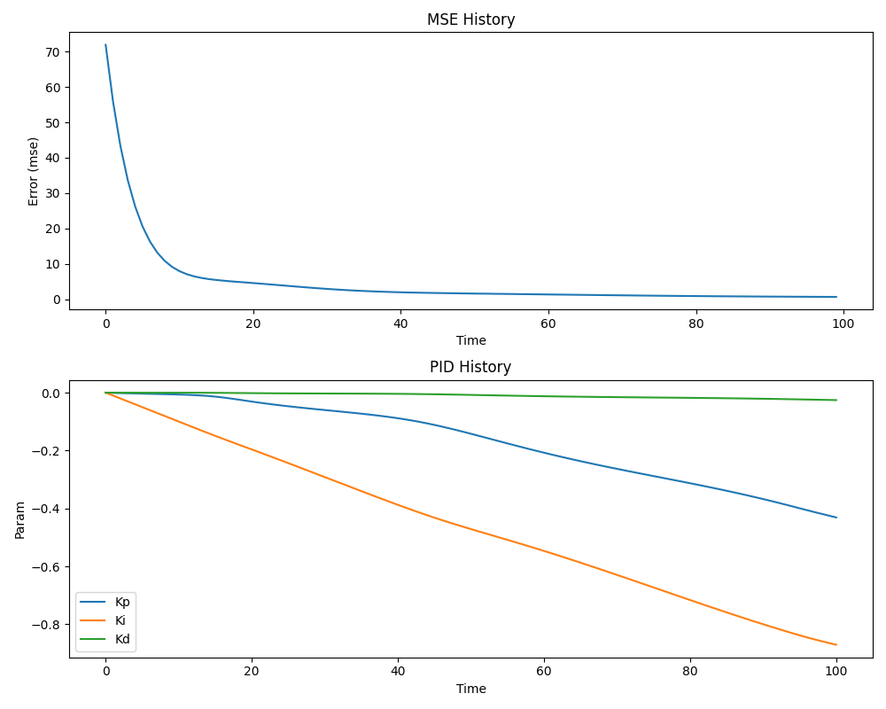
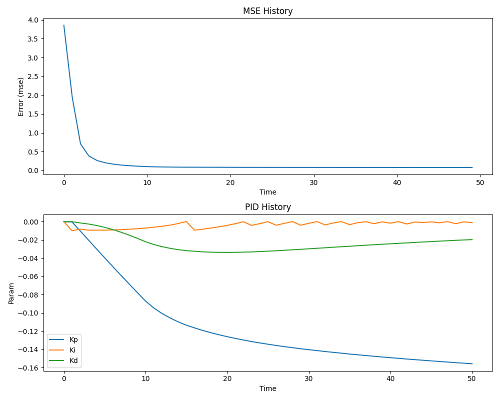
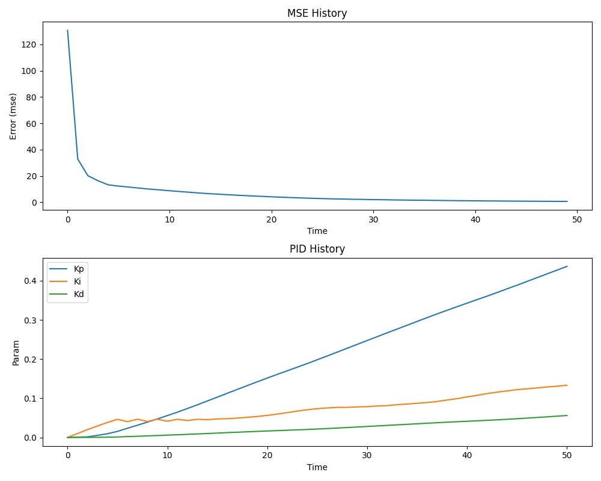
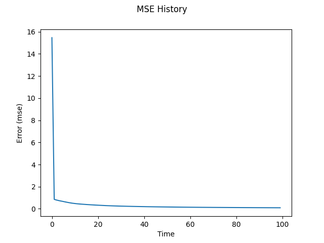
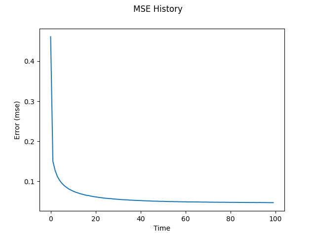
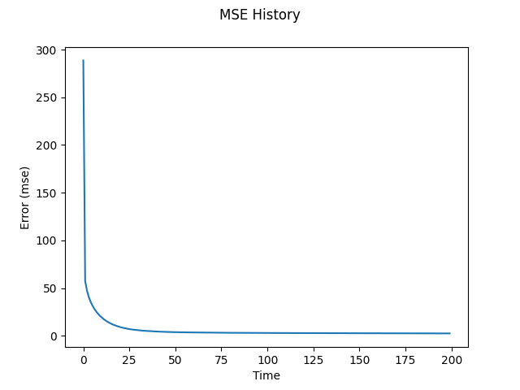

# Report: A General Purpose JAX-based Controller

## Table of Contents

- [Classical PID Controller](#classical-pid-controller)
  - [Bathtub](#1-bathtub-pid)
  - [Cournot Competition](#2-cournot-competition-pid)
  - [Monetary Policy](#3-monetary-policy-pid)
- [Neural Network Controller](#neural-network-controller)
  - [Bathtub](#1-bathtub-nn)
  - [Cournot Competition](#2-cournot-competition-nn)
  - [Monetary Policy](#3-monetary-policy-nn)
- [Monetary Policy Model Explanation](#monetary-policy-model-explanation)

## Executive Summary

This report presents the implementation and analysis of two control approaches - Classical PID and Neural Network controllers - applied to three different systems: a bathtub water level control system, a Cournot competition economic model, and a monetary policy control system. Each implementation is evaluated based on its convergence characteristics and control performance. The results demonstrate the effectiveness of both approaches, with each showing distinct advantages in different scenarios.

## Classical PID Controller

### 1. Bathtub (PID)

#### Configuration

| Parameter                      | Value                  |
| ------------------------------ | ---------------------- |
| Controller Type                | Classic PID            |
| Initial Parameters             | Kp = 0, Ki = 0, Kd = 0 |
| Epochs                         | 100                    |
| Timesteps                      | 50                     |
| Learning Rate                  | 0.01                   |
| Disturbance Range              | -0.01, 0.01            |
| Cross-sectional Area (bathtub) | 20                     |
| Cross-sectional Area (drain)   | 0.2                    |
| Initial Water Height           | 50                     |

#### Plot



#### Training Progress

The MSE history plot shows rapid initial convergence from a high error value around 70, quickly dropping to below 10 within the first 20 epochs. The error continues to decrease more gradually converging towards 2.

The PID parameter history reveals interesting dynamics in the controller's adaptation. Kp (proportional) and Ki (integral) terms show steady negative growth, with Kp reaching approximately -0.4 and Ki approaching -0.8 by the end of training. The Kd (derivative) term remains relatively stable near 0, suggesting minimal influence of the rate of change in the control strategy.

### 2. Cournot Competition (PID)

#### Configuration

| Parameter          | Value                  |
| ------------------ | ---------------------- |
| Controller Type    | Classic PID            |
| Initial Parameters | Kp = 0, Ki = 0, Kd = 0 |
| Epochs             | 50                     |
| Timesteps          | 50                     |
| Learning Rate      | 0.01                   |
| Disturbance Range  | -0.01, 0.01            |
| Max Price          | 10                     |
| Marginal Cost      | 2                      |
| Target Profit      | 4                      |
| Q1                 | 2                      |
| Q2                 | 2                      |
| Initial Profit p1  | 0                      |

#### Plot



#### Training Progress

The MSE history demonstrates grear convergence characteristics, starting from an error of approximately 4.0 and rapidly decreasing to below 0.5 within the first 10 epochs. The system maintains stable performance for the remainder of the training period, with the error asymptotically approaching a minimal value around 0.2.

The PID parameters show distinct evolutionary patterns. The Kp term decreases steadily to approximately -0.15, while Ki and Kd terms stabilize at around 0 and -0.02 respectively, indicating a control strategy that relies primarily on proportional response to profit deviations.

### 3. Monetary Policy (PID)

#### Configuration

| Parameter                          | Value                  |
| ---------------------------------- | ---------------------- |
| Controller Type                    | Classic PID            |
| Initial Parameters                 | Kp = 0, Ki = 0, Kd = 0 |
| Epochs                             | 50                     |
| Timesteps                          | 50                     |
| Learning Rate                      | 0.01                   |
| Disturbance Range                  | -0.01, 0.01            |
| Target Interest Rate               | 2                      |
| Target Output Gap                  | 0                      |
| Target Inflation                   | 3                      |
| Initial Inflation                  | 7                      |
| Initial Output Gap                 | -1                     |
| Output Gap Self-correction Rate    | 0.1                    |
| Interest Rate Effect on Output Gap | 0.5                    |
| Output Gap Effect on Inflation     | 0.3                    |
| Inflation Self-correction Rate     | 0.2                    |

#### Plot



#### Training Progress

The MSE history plot shows a sharp initial decline from approximately 120 to below 20 within the first 10 epochs. The error continues to decrease more gradually thereafter, reaching a steady state below 5 by epoch 30. This pattern indicates rapid initial learning followed by fine-tuning of the control parameters.

The PID parameter evolution shows a unique pattern compared to the other systems. All three parameters (Kp, Ki, Kd) show positive growth, with Kp reaching approximately 0.45, Ki around 0.12, and Kd about 0.05 by the end of training. This suggests that the monetary policy control system benefits from a more balanced contribution of all three control terms, with the proportional term playing the dominant role in the response to deviations from target inflation.

## Neural Network Controller

### 1. Bathtub (NN)

#### Configuration

| Parameter                      | Value          |
| ------------------------------ | -------------- |
| Controller Type                | Neural Network |
| Epochs                         | 100            |
| Timesteps                      | 100            |
| Learning Rate                  | 0.01           |
| Number of Layers               | 4              |
| Neurons per Layer              | [3, 5, 5, 1]   |
| Weight Init Range              | -0.1, 0.1      |
| Bias Init Range                | -0.05, 0.05    |
| Disturbance Range              | -0.01, 0.01    |
| Cross-sectional Area (bathtub) | 20             |
| Cross-sectional Area (drain)   | 0.2            |
| Initial Water Height           | 50             |

#### Plot



#### Training Progress

The MSE history shows quick adaptation and learning, with the error starting at approximately 16 and dropping sharply within the first few epochs to around 1. After this initial rapid decrease, the system continues to improve gradually, maintaining stable performance with an MSE close to 0.5 for the remainder of training. The smooth decay curve suggests that the neural network effectively learned the control strategy without experiencing significant instability or issues.

### 2. Cournot Competition (NN)

#### Configuration

| Parameter         | Value          |
| ----------------- | -------------- |
| Controller Type   | Neural Network |
| Epochs            | 100            |
| Timesteps         | 100            |
| Learning Rate     | 0.01           |
| Number of Layers  | 4              |
| Neurons per Layer | [3, 5, 5, 1]   |
| Weight Init Range | -0.1, 0.1      |
| Bias Init Range   | -0.05, 0.05    |
| Disturbance Range | -0.01, 0.01    |
| Max Price         | 10             |
| Marginal Cost     | 2              |
| Target Profit     | 4              |
| Q1                | 2              |
| Q2                | 2              |
| Initial Profit p1 | 0              |

#### Plot



#### Training Progress

The MSE history demonstrates robust learning behavior, with the error starting at approximately 0.45 and quickly decreasing to around 0.1 within the first 20 epochs. The learning curve shows a smooth, monotonic decrease without significant oscillations, suggesting stable optimization. The final MSE stabilizes at approximately 0.025, indicating that the neural network controller successfully learned to maintain the target profit levels despite market disturbances.

### 3. Monetary Policy (NN)

#### Configuration

| Parameter                          | Value          |
| ---------------------------------- | -------------- |
| Controller Type                    | Neural Network |
| Epochs                             | 200            |
| Timesteps                          | 20             |
| Learning Rate                      | 0.0001         |
| Number of Layers                   | 4              |
| Neurons per Layer                  | [3, 5, 5, 1]   |
| Weight Init Range                  | -0.1, 0.1      |
| Bias Init Range                    | -0.05, 0.05    |
| Disturbance Range                  | -0.01, 0.01    |
| Target Interest Rate               | 2              |
| Target Output Gap                  | 0              |
| Target Inflation                   | 3              |
| Initial Inflation                  | 7              |
| Initial Output Gap                 | -1             |
| Output Gap Self-correction Rate    | 0.1            |
| Interest Rate Effect on Output Gap | 0.5            |
| Output Gap Effect on Inflation     | 0.3            |
| Inflation Self-correction Rate     | 0.2            |

#### Plot



#### Training Progress

The error begins at a relatively high value of approximately 300 and shows a sharp initial decline to around 10 within the first 25 epochs. The learning rate was set lower (0.0001) compared to the other systems, leading to a more gradual but stable convergence. After the initial rapid improvement, the system continues to optimize more slowly, eventually reaching and maintaining an MSE below 5 by epoch 200. I used shorter epochs for this run, as the gradients tended to explode with longer training periods.

---

# Monetary Policy Model Explanation

## Overview

This model simulates a simplified central banking system where a monetary authority attempts to control inflation through interest rate adjustments while considering the output gap. It represents a dynamic system with two key state variables:

- π (pi): The inflation rate
- y: The output gap (difference between actual and potential GDP)

## Control Objective

The primary goal is to maintain inflation (π) at a target level (π_target) while keeping the output gap (y) close to its target (typically 0), using the interest rate (r) as the control signal.

## System Dynamics

The model uses two coupled differential equations that capture the relationship between interest rates, output gap, and inflation:

### Output Gap Dynamics

```
dy/dt = -a(y - y_target) - b(r - r_target)
```

Where:

- a: Output gap self-correction rate (how quickly the economy returns to potential)
- b: Interest rate effect on output gap (how much interest rates affect economic activity)
- r: Current interest rate (control signal)
- r_target: Natural interest rate

### Inflation Dynamics

```
dπ/dt = c(y - y_target) - d(π - π_target) + disturbance
```

Where:

- c: Output gap effect on inflation (Phillips curve relationship)
- d: Inflation self-correction rate
- disturbance: External shocks to inflation (i.e., noise)
